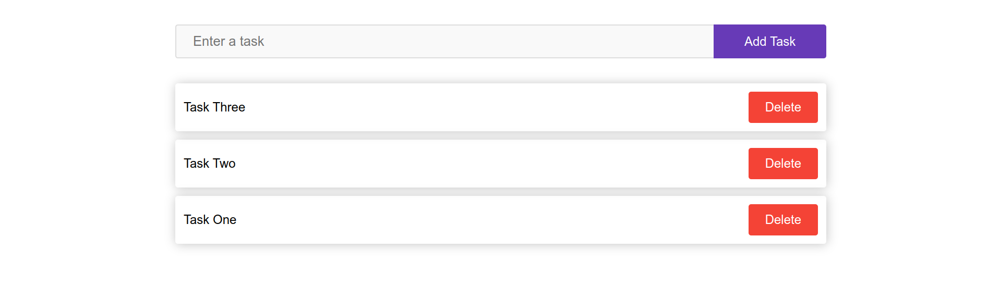
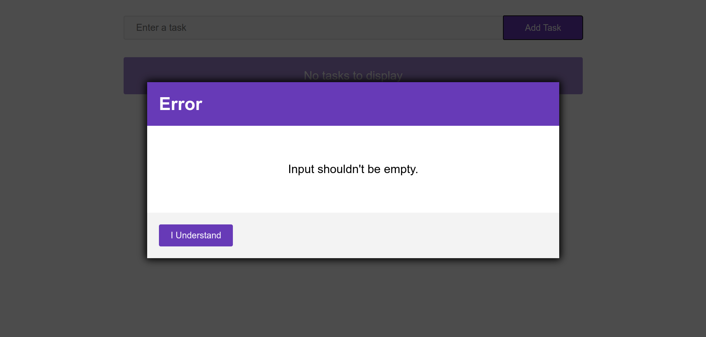

## To Do App using React Js

A to do app using react js which allows user to :

- Add tasks
- Remove tasks
- Mark tasks as completed

Tasks are kept at local storage

[Live Demo](https://ahmedhamdy96.github.io/React-To-Do-App/)
